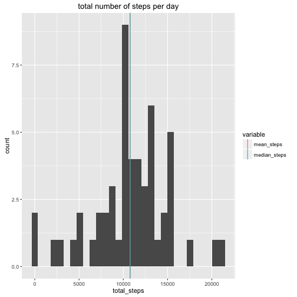
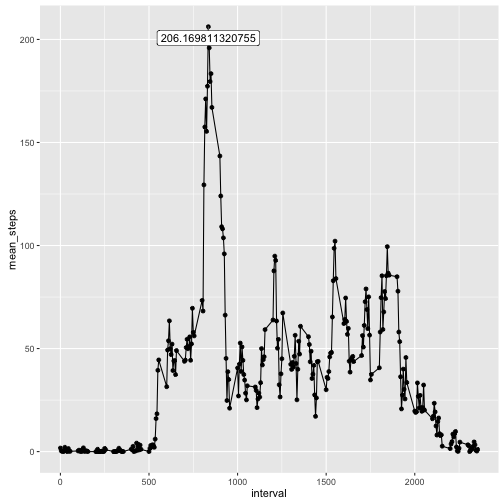
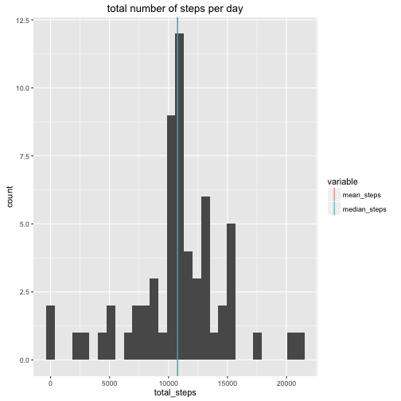
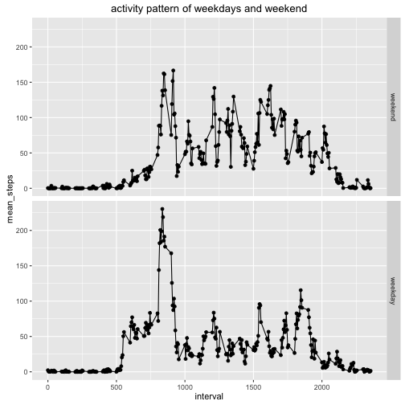

## Introduction 

It is now possible to collect a large amount of data about personal movement using activity monitoring devices such as a Fitbit, Nike Fuelband, or Jawbone Up. These type of devices are part of the “quantified self” movement – a group of enthusiasts who take measurements about themselves regularly to improve their health, to find patterns in their behavior, or because they are tech geeks. But these data remain under-utilized both because the raw data are hard to obtain and there is a lack of statistical methods and software for processing and interpreting the data.

This exercise is about experiement for average activities from the data gathered from acitivty monitor in a 5-minute interval. 

Dataset: [[https://d396qusza40orc.cloudfront.net/repdata%2Fdata%2Factivity.zip][Activity monitoring data]

The variables included in this dataset are:

   * steps: Number of steps taking in a 5-minute interval (missing values are coded as 𝙽𝙰)
   * date: The date on which the measurement was taken in YYYY-MM-DD format
   * interval: Identifier for the 5-minute interval in which measurement was taken

## Loading and preprocessing the data
Load activity data from activity.csv file that was downloaded from the dataset link provided above. 


```r
library(dplyr)
library(ggplot2)
library(reshape2)
library(ggrepel)

activity <- read.csv("activity.csv")
```

## mean total number of steps taken per day?
Calculate the mean and median of the total number of steps taken per day. 
As an experiment examples of date and plot total number of steps per day in histogram 
with mean steps 10766.19 and median 10765. 


```r
stepsPerDay <- activity %>% 
    filter(!is.na(steps)) %>% 
    group_by(date) %>%
    summarise(total_steps=sum(steps))
stepsPerDay
```

```
## Source: local data frame [53 x 2]
## 
##          date total_steps
##        (fctr)       (int)
## 1  2012-10-02         126
## 2  2012-10-03       11352
## 3  2012-10-04       12116
## 4  2012-10-05       13294
## 5  2012-10-06       15420
## 6  2012-10-07       11015
## 7  2012-10-09       12811
## 8  2012-10-10        9900
## 9  2012-10-11       10304
## 10 2012-10-12       17382
## ..        ...         ...
```

```r
avgStepsPerDay <- stepsPerDay %>% 
    summarise(mean_steps=mean(total_steps), median_steps=median(total_steps))
avgStepsPerDay <- melt(avgStepsPerDay, value.name="avg_steps")
```

```
## No id variables; using all as measure variables
```

```r
avgStepsPerDay
```

```
##       variable avg_steps
## 1   mean_steps  10766.19
## 2 median_steps  10765.00
```

```r
ggplot(stepsPerDay, aes(total_steps)) + 
    geom_histogram() +
    ggtitle("total number of steps per day") + 
    geom_vline(data=avgStepsPerDay, aes(xintercept=avg_steps, colour = variable), show.legend=TRUE)
```

```
## `stat_bin()` using `bins = 30`. Pick better value with `binwidth`.
```



## Average daily activity pattern 
Below time series plot of the 5-minute interval (x-axis) and the average number
of steps take, averaged across all days(y-axis).


```r
averageDailyActivity <- activity %>% 
    filter(!is.na(steps)) %>% 
    group_by(interval) %>% 
    summarise(mean_steps=mean(steps), median_steps=median(steps))

maxAvgSteps <- averageDailyActivity %>% 
    arrange(desc(mean_steps)) %>% 
    slice(1) 

maxAvgSteps
```

```
## Source: local data frame [1 x 3]
## 
##   interval mean_steps median_steps
##      (int)      (dbl)        (int)
## 1      835   206.1698           19
```

```r
ggplot(averageDailyActivity, aes(x=interval, y=mean_steps)) + 
    geom_point() + 
    geom_line() +
    geom_label_repel(data=maxAvgSteps, aes(x=interval, y=mean_steps, label=mean_steps))
```



## Imputing missing values
Note that there are a number of days/intervals where there are missing values (coded as 𝙽𝙰). The presence of missing days may introduce bias into some calculations or summaries of the data. 

Around 13% of total record has missing values. So filling those missing values with 
mean for that 5-minute interval to avoid bias. 


```r
summary(is.na(activity$steps))
```

```
##    Mode   FALSE    TRUE    NA's 
## logical   15264    2304       0
```

```r
mean(is.na(activity$steps))
```

```
## [1] 0.1311475
```

```r
validActivity <- activity %>% filter(!is.na(steps))
missingActivity <- activity %>% filter(is.na(steps)) 
missingActivity <- merge(missingActivity, averageDailyActivity, by="interval") %>% 
    mutate(steps=mean_steps) %>% select(interval, steps, date)

imputedActivity <- rbind(missingActivity, validActivity)
```

Make a histogram of the total number of steps taken each day and Calculate and report the mean and median total number of steps taken per day to see the differences with the original data. 

By imptuing the missing values, mean and median steps of the day has the same value. 
Now mean and media steps are both 10766.19 whereas mean steps 10766.19 /median 10765 with original data.  


```r
stepsPerDay <- imputedActivity %>% 
    group_by(date) %>%
    summarise(total_steps=sum(steps))

avgStepsPerDay <- stepsPerDay %>% 
    summarise(mean_steps=mean(total_steps), median_steps=median(total_steps))
avgStepsPerDay <- melt(avgStepsPerDay, value.name="avg_steps")
```

```
## No id variables; using all as measure variables
```

```r
avgStepsPerDay
```

```
##       variable avg_steps
## 1   mean_steps  10766.19
## 2 median_steps  10766.19
```

```r
ggplot(stepsPerDay, aes(total_steps)) + 
    geom_histogram() +
    ggtitle("total number of steps per day") + 
    geom_vline(data=avgStepsPerDay, aes(xintercept=avg_steps, colour = variable), show.legend=TRUE) 
```

```
## `stat_bin()` using `bins = 30`. Pick better value with `binwidth`.
```



## Differences in activity patterns between weekdays and weekends

Experiment for the activity patterns between weekdays and weekends using the imputed activity data. To visualize, make a panel plot containing a time series plot of 𝚕") of the 5-minute interval (x-axis) and the average number of steps taken, averaged across all weekday days or weekend days (y-axis). 

As you can see the acitivity pattern of weekdays and weekend quite differences. 
From this, we can see more activities in the moring time in weekdays whereas see more activities over the daytime in weekend. 
 

```r
weekdays <- c('Monday', 'Tuesday', 'Wednesday', 'Thursday', 'Friday')
imputedWeekdayActivity <- imputedActivity %>% 
    mutate(weekdays=factor((weekdays(as.Date(date)) %in% weekdays), levels=c(FALSE, TRUE),labels=c('weekend', 'weekday')))

averageWeekdaysActivity <- imputedWeekdayActivity %>% 
    group_by(weekdays, interval) %>%
    summarise(mean_steps=mean(steps), median_steps=median(steps))

ggplot(averageWeekdaysActivity, aes(x=interval, y=mean_steps)) + 
    facet_grid(weekdays ~ .) +
    ggtitle("activity pattern of weekdays and weekend") + 
    geom_point() + 
    geom_line()
```


